# .NET Serverless EventBridge Workshop

The workshop walks developers through an experience of developing a .NET 6 ASP web api using API Gateway and Lambda. The Lambda processes the HTTP request and places and event on EventBridge which triggers a rule to deliver an SMS notification via SNS!

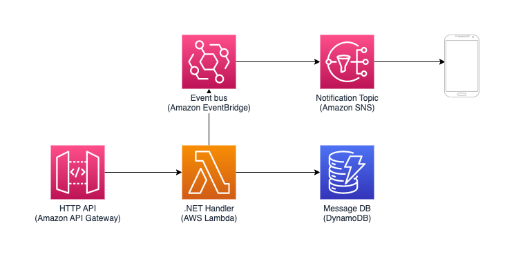

# 1. Tooling up

## (Locally) 
### nstall the .NET SDK and AWS CLI
- https://dotnet.microsoft.com/en-us/download 
- https://docs.aws.amazon.com/cli/latest/userguide/getting-started-install.html

Run the following to verify installation:

``` 
dotnet --version
6.0.412
```
### Setup AWS Credentials

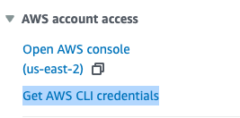

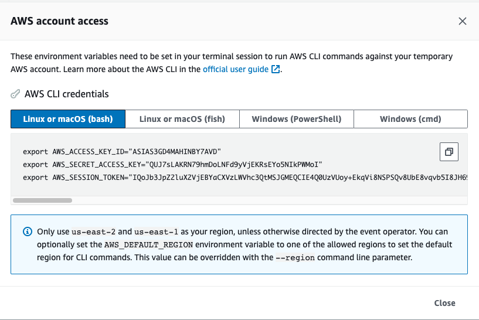
Set your environment variable with credentials 


## (Remotely) Cloud9
Alternatively if you do not have permission to install the runtimes you may want to complete this workshop on a Cloud9 environment 
1. https://docs.aws.amazon.com/cloud9/latest/user-guide/create-environment-main.html
2. https://docs.aws.amazon.com/cloud9/latest/user-guide/sample-dotnetcore.html (Stop after Step 2)


## Set up build log storage

Create a new S3 bucket by logging into your AWS account. This bucket will be used to store build logs
```
aws s3api create-bucket --bucket <ACCOUNT ID>  --create-bucket-configuration LocationConstraint=<AWS_REGION>
```
Make sure to save this bucket name or set it as an environment variable


# 2. Build your first .NET Serverless Application
AWS Lambda is a serverless, event-driven compute service that lets you run code for virtually any type of application or backend service without provisioning or managing servers. You can trigger Lambda from over 200 AWS services and software as a service (SaaS) applications, and only pay for what you use. 

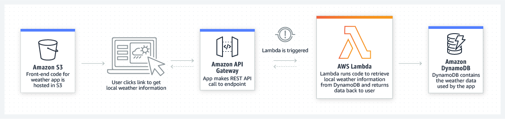

## Install .NET Lambda Tools and serverless templates

In the .NET CLI, you use the new command to create .NET projects from a command line. This is useful if you want to create a project outside of Visual Studio. To view a list of the available project types, open a command line, navigate to where you installed the .NET Core runtime, and then run the following command:

```
dotnet new -i Amazon.Lambda.Templates
```

AWS also provides tool extensions to the .NET CLI focused on building .NET Core and ASP.NET Core applications and deploying them to AWS services. Many of these deployment commands are the same commands the AWS Toolkit for Visual Studio uses to perform its deployment features.

```
dotnet tool install -g Amazon.Lambda.Tools
```


## Create an ASP.NET app from a blueprint
We will use the serverless.AspNetCoreWebAPI template. This template produces a simple ASP web API. The application has the required setup to deploy an API Gateway that proxies incoming web requests to AWS Lambda function which has an ASP app deployed to it. It has the necessary code that converts the Lambda Event to ASP.NET context implicity. This allows you to write this app as a regular ASP.NET app. 

https://github.com/aws/aws-lambda-dotnet

Use the below command to list the available serverless templates and then create the app:

```
# List Serverless Templates

dotnet new list --author AWS     

# Create an app

dotnet new serverless.AspNetCoreWebAPI --name DotNetServerlessProject

# Navigate to app directory

cd DotNetServerlessProject/src/DotNetServerlessProject

# Install dependencies
dotnet restore
```

## Generated Files
Some of the key generated files are:
```
.
├── Controllers
│   └── ValuesController.cs
├── LambdaEntryPoint.cs
├── LocalEntryPoint.cs
├── MyDotNetServerLessApp.csproj
├── Readme.md
├── Startup.cs
├── appsettings.Development.json
├── appsettings.json
├── aws-lambda-tools-defaults.json
├── bin
│   └── Debug
├── obj
│   └── Debug
└── serverless.template
```
- aws-lambda-tools-defaults.json: This is where the aws default values are held. For E.g. AWS Region, AWS credential profile, etc. These are used by the .Net Lambda Tools if we don't provide them when we run the dotnet lambda commands
- LambdaEntryPoint.cs: This is entry point for the AWS Lambda Function. Code in this file converts a Lammbda Source Event to ASP.NET context so that we can write core like a regular ASP.NET app
- serverless.template: The AWS SAM template file. This is where we define the AWS resources that will be used in the application.
- Startup.cs: In this file we have code that tells what to do when a GET request is made on our API.

## Deploy your lambda
With dependencies installed we can now deploy our first lambda function!
`dotnet lambda deploy-serverless --stack-name DotNetServerlessStack --s3-bucket <REPLACE WITH S3 BUCKET NAME>`

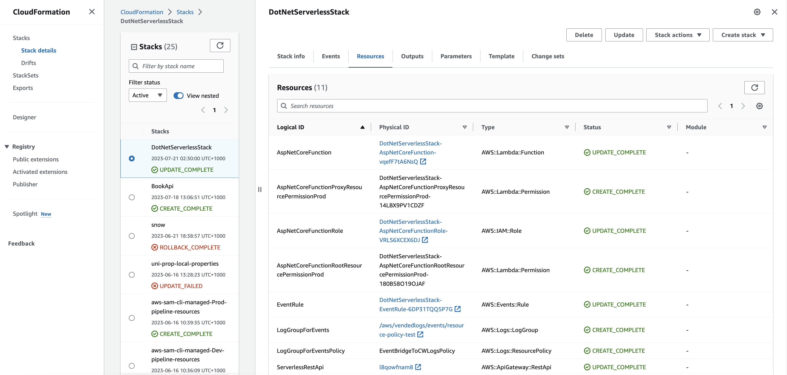
Resource Status should visibile in ClouFormation

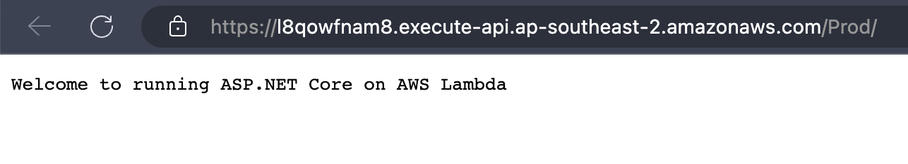
And the endpoint is responding

# 3. Add Serverless storage

The serverless.template file is a SAM template file and like AWS CloudFormation supports both JSON and YAML formats. 

https://www.json2yaml.com/

##  Convert your serverless.template file from JSON to YAML for readability
You can choose to convert it to YAML for better readability using any online converter. We will have to remove Role property in the YAML file as it will create one if not defined.
Be sure to update the filename to `severless.yaml` for syntax checking and update `aws-lambda-tools-defaults.json` with the new filename

## Add DynamoDB to the serverless.template 
https://docs.aws.amazon.com/serverless-application-model/latest/developerguide/sam-specification-resources-and-properties.html

**Can you use the docs to:**
1. Create DynamoDB table with primary key: `myID` and type: `string` to the SAM template?
2. Provide lambda the required permissions to access DynamoDB?


<details><summary>Click to see how we did it</summary>

```
  StorageTable:
    Type: AWS::Serverless::SimpleTable
    Properties:
      TableName: MyStorageTable
      PrimaryKey:
        Name: myID
        Type: String
```

Update your lambda function with the permissions to access the DynamoDB table
```
      Policies:
      - AWSLambda_FullAccess
      - DynamoDBCrudPolicy:
          TableName: !Ref StorageTable
```
</details>

## Write the data models
The AWS SDK for .NET provides an object persistence model that enables you to map your client-side classes to Amazon DynamoDB tables. Each object instance then maps to an item in the corresponding tables. To save your client-side objects to the tables, the object persistence model provides the DynamoDBContext class, an entry point to DynamoDB. This class provides you a connection to DynamoDB and enables you to access tables, perform various CRUD operations, and run queries.

```
dotnet add package AWSSDK.DynamoDBv2
```

Create a new folder called `Models` and a new file called `Message.cs`
```
.
├── Controllers
├── DotNetServerlessProject.csproj
├── LambdaEntryPoint.cs
├── LocalEntryPoint.cs
├── Models
│   └── Message.cs  <--- NEW FILE!
├── Readme.md
├── Startup.cs
├── appsettings.Development.json
├── appsettings.json
├── aws-lambda-tools-defaults.json
└── serverless.yaml

```
https://docs.aws.amazon.com/amazondynamodb/latest/developerguide/DotNetSDKHighLevel.html

**Can you use the docs to write a data model?**

<details><summary>Example data model</summary>

```
using Amazon.DynamoDBv2.DataModel;

namespace Store.Model
{
    [DynamoDBTable("MyStorageTable")]
    public class Message {

        [DynamoDBHashKey]
        public Guid myID { get; set; } = Guid.Empty;

        [DynamoDBProperty]
        public string message { get; set; } = string.Empty;
        [DynamoDBProperty]
        public string otherStuff { get; set; } = string.Empty;
        

    }
}
```
</details>


## Implement the Repostory pattern for DynamoDB
```
.
├── Controllers
│   └── ValuesController.cs
├── DotNetServerlessProject.csproj
├── LambdaEntryPoint.cs
├── LocalEntryPoint.cs
├── Models
│   └── Message.cs
├── Readme.md
├── Repositories
│   └── MessageRepository.cs  <--- Create this file
├── Startup.cs
├── appsettings.Development.json
├── appsettings.json
├── aws-lambda-tools-defaults.json
```

<details><summary>Example Repositry pattern implementation</summary>

```
using Amazon.DynamoDBv2.DataModel;
using Store.Model;

namespace Store.Access
{
    public class MessageRepository
    {
        private readonly IDynamoDBContext context;

        public MessageRepository(IDynamoDBContext context)
        {
            this.context = context;
        }
        public async Task<Guid> CreateAsync(Message message)
        {
            try
            {
                message.myID = Guid.NewGuid();
                await context.SaveAsync(message);
            }
            catch (Exception e)
            {
                return Guid.Empty;
            }
            return message.myID;
        }

        public async Task<Message?> GetByIdAsync(Guid id)
        {
            try
            {
                return await context.LoadAsync<Message>(id);
            }
            catch (Exception e)
            {
                return null;
            }
        }
    }

}
```
</details>

## Handle the PUT request
MVC controllers are responsible for responding to requests made against an ASP.NET MVC website. Each browser request is mapped to a particular controller. 

For more information visit the 
[official docs here](https://learn.microsoft.com/en-us/aspnet/core/web-api/?view=aspnetcore-6.0)
```
.
├── Controllers
│   └── ValuesController.cs <--- Implement here
├── DotNetServerlessProject.csproj
├── LambdaEntryPoint.cs
├── LocalEntryPoint.cs
├── Models
├── Readme.md
├── Repositories
├── Startup.cs
├── appsettings.Development.json
├── appsettings.json
├── aws-lambda-tools-defaults.json
├── bin
├── obj
└── serverless.yaml
```

Update the HttpPut handler to 
```
    // PUT api/values/5
    [HttpPut]
    public async Task<Guid> Put([FromBody]Message message)
    {
        return await messageRepository.CreateAsync(message);
    }

```

## Deploy your changes
`dotnet lambda deploy-serverless --stack-name DotNetServerlessStack --s3-bucket <REPLACE WITH S3 BUCKET NAME>`


## Let's test the API!
Don't forget to replace the URL with your API Gateway endpoint

`curl -X PUT <YOUR API ENDPOINT>/api -d '{"message":"this is the message", "otherStuff":"this is otherStuff"}' -H 'Content-Type: application/json'`

# 4. Publish requests to an Event Bus
## Amazon EventBridge
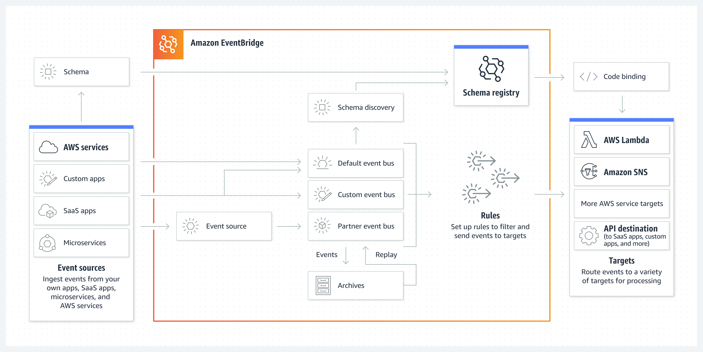
Amazon EventBridge Event Bus is a serverless service that uses events to connect application components together, making it easier for you to build scalable event-driven applications. Use it to route events from sources such as home-grown applications, AWS services, and third- party software to consumer applications across your organization. EventBridge provides a simple and consistent way to ingest, filter, transform, and deliver events so you can build new applications quickly.

EventBridge event buses are well suited for many-to-many routing of events between event-driven services. 

## Amazon CloudWatch
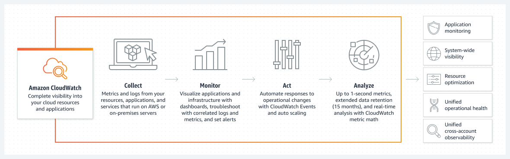
Amazon CloudWatch collects and visualizes real-time logs, metrics, and event data in automated dashboards to streamline your infrastructure and application maintenance.

## Add EventBridge and log events to CloudWatch

Can you use the serverless land repository to:

1. Create and EventBridge rule to capture events?
2. Set CloudWatch as the target?
3. Add permissions to the Lambda function to allow pusblishing events to EventBridge?

https://serverlessland.com/patterns/eventbridge-cloudwatch

<details><summary>Answer</summary>

Copy the code snippet below into `serverless.yaml` and add it under the `Resources` section

```
  EventRule:
    Type: AWS::Events::Rule
    Properties:
      Description: "My Description"
      EventPattern:
        source:
          - "my.source"
      Targets:
        - Arn: !GetAtt LogGroupForEvents.Arn
          Id: LogTarget
  LogGroupForEvents:
    Type: AWS::Logs::LogGroup
    Properties:
      LogGroupName: /aws/vendedlogs/events/resource-policy-test
  LogGroupForEventsPolicy:
    Type: AWS::Logs::ResourcePolicy
    Properties:
      PolicyName: EventBridgeToCWLogsPolicy
      PolicyDocument: !Sub >
        {
          "Version": "2012-10-17",
          "Statement": [
            {
              "Sid": "EventBridgetoCWLogsCreateLogStreamPolicy",
              "Effect": "Allow",
              "Principal": {
                "Service": [
                  "events.amazonaws.com"
                ]
              },
              "Action": [
                "logs:CreateLogStream"
              ],
              "Resource": [
                "${LogGroupForEvents.Arn}"
              ]
            },
            {
              "Sid": "EventBridgetoCWLogsPutLogEventsPolicy",
              "Effect": "Allow",
              "Principal": {
                "Service": [
                  "events.amazonaws.com"
                ]
              },
              "Action": [
                "logs:PutLogEvents"
              ],
              "Resource": [
                "${LogGroupForEvents.Arn}"
              ]
            }
          ]
        }
```

</details>

<details><summary>Answer</summary>
 
Use the below policies for the Lambda function
 
```
      Policies:
      - AWSLambda_FullAccess
      - DynamoDBCrudPolicy:
          TableName: !Ref StorageTable
      - Version: '2012-10-17'
        Statement:
          - Effect: Allow
            Action:
              - events:PutEvents
            Resource:
              - '*'
```

</details>

## Install helper packages

We will need to add some packages to make our life easier and to make the EventBridge classes available. Run the below two commands to add packages:

```
# Add the Newtonjson package for a JSON helper

dotnet add package Newtonsoft.Json

# Add the Amazon EventBridge Package

dotnet add package AWSSDK.EventBridge

```

## Create Event Data

We will first create a public class that has the structure of the event. We will base this on a standard EventBridge Schema and have some event data. 
```
.
├── Controllers
├── DotNetServerlessProject.csproj
├── Events
│   └── Notify.cs     <-- Create this file
├── LambdaEntryPoint.cs
├── LocalEntryPoint.cs
├── Models
├── Readme.md
├── Repositories
├── Startup.cs
├── appsettings.Development.json
├── appsettings.json
├── aws-lambda-tools-defaults.json
└── serverless.yaml
```

Create a new folder called `Events` and a new file `Notify.cs` copy the below code snippet:

<details><summary>Code Snippet</summary>

```

using Newtonsoft.Json;
using Amazon.EventBridge.Model;

namespace Producer.Data
{
  public class Notification
  {
    public static PutEventsRequest transactionEvents = new PutEventsRequest
    {
      Entries =
        {
            new PutEventsRequestEntry
            {
                Source = "my.source",
                EventBusName = "default",
                DetailType = "sampleEvent",
                Time = DateTime.Now,
                Detail = JsonConvert.SerializeObject(
                    new
                    {
                        action = "An HTTP Request came through",
                        location = "somewhere on this planet",
                        amount = 500,
                        result = "What happened as a result",
                        transactionId = "123456"
                    }
                )
            }
        }
    };
  }
}

```
</details>

## Send the Event

Now lets go to `Startup.cs` and send events everytime the Lamdba function gets invoked on a HTTP GET. Add the following references:

```
using Producer.Data;
using Amazon.EventBridge.Model;
using Amazon.EventBridge;

```

Replace the POST controller route with the code snippet

```
    // POST api/values
    [HttpPost]
    public async Task<Guid> Post([FromBody] MessageIDRequest messageIDRequest){
        Message message = await messageRepository.GetByIdAsync(new Guid(messageIDRequest.messageID)) ?? new Message {myID = Guid.Empty, message= "empty", otherStuff="empty"};
        PutEventsRequest events = new Event().eventBuilder(message);
        AmazonEventBridgeClient client = new AmazonEventBridgeClient();
        await client.PutEventsAsync(events);
        return message.myID;
    }
```

## Did it work?
`dotnet lambda deploy-serverless --stack-name DotNetServerlessStack --s3-bucket <REPLACE WITH S3 BUCKET NAME>`

Once Deployed:
1. Navigate to DynamoDB and find a valid message ID
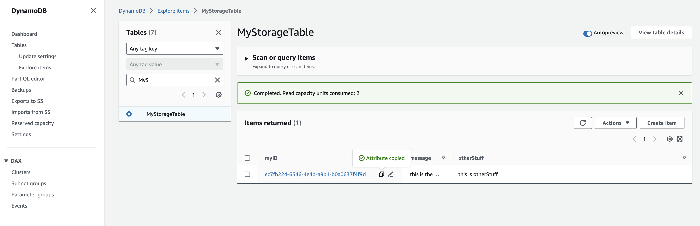

2. Construct a HTTP POST request to test the API

`curl -X POST <YOUR API ENDPOINT>/api -d '"<YOUR MESSAGE ID>"' -H "Content-Type: application/json"`

3. Navigate to CloudWatch to view the logged event
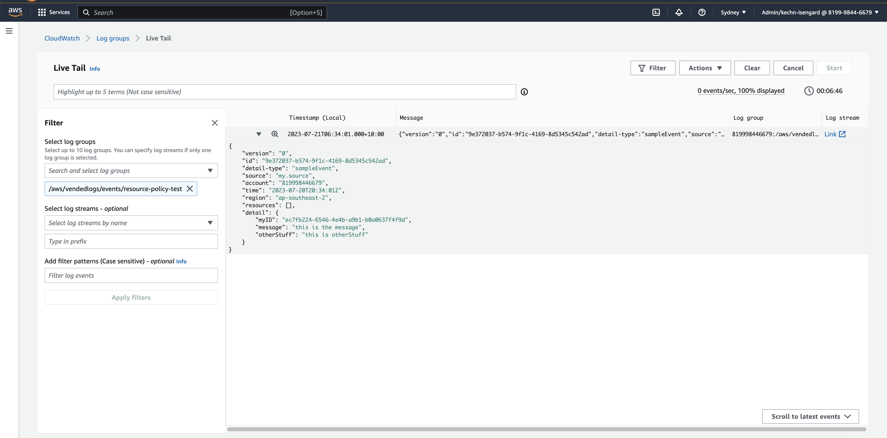


# 5. SMS Notifications
## Amazon Simple Notification Services

Amazon SNS is a fully managed Pub/Sub service for A2A and A2P messaging

Now that we have EventBridge setup, we need to write code that will send an event EventBridge. This event will trigger the rule and get published to SNS Topic. The actual delivery of a message to an SNS supported endpoint requires a subscription to be created on the SNS Topic as well. 


## Notification Delivery

Now that our HTTP API when invoked emits an event to SNS, all thats left is to subscribe to the SNS topic to receive the notification. To do this we edit the `serverless.template` file and add a Subscription on the Topic. Add the below code snippet under the `Resources` section. Be sure to replace the `Endpoint` value with your mobile number in the `10DL` format - `+610000000000`:

```
  Topic:
    Type: AWS::SNS::Topic
  Subscription:
    Type: AWS::SNS::Subscription
    Properties:
      TopicArn: !Ref Topic
      Endpoint: "+610000000000"
      Protocol: sms

  EventBridgeToSnSPolicy:
    Type: AWS::SNS::TopicPolicy
    Properties: 
      PolicyDocument:
        Statement:
        - Effect: Allow
          Principal:
            Service: events.amazonaws.com
          Action: sns:Publish
          Resource: !Ref Topic
      Topics:
        - !Ref Topic
```

and add the SNS topic as a target for EventBridge

```
      Targets:
        - Arn: !GetAtt LogGroupForEvents.Arn
          Id: LogTarget
        - Arn: !Ref Topic
          Id: "Topic"
```

## Receiving a SMS
First we need to go to SNS and verify our phone number in Amazon SNS

Go to the text messaging 

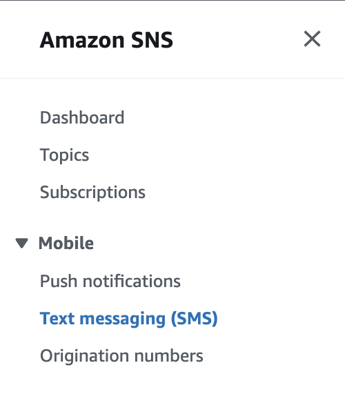

and verify your phone number for sending an event

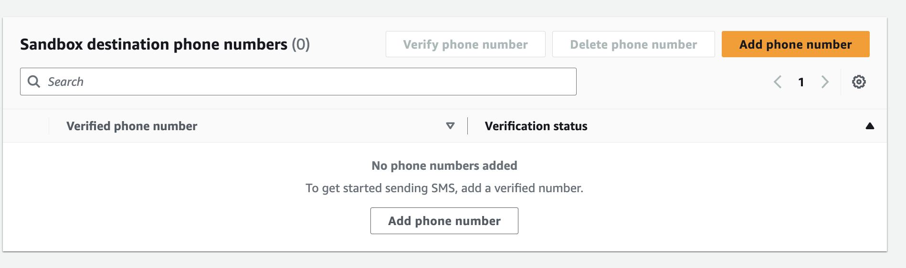

Trigger the event and receive your SMS!

`curl -X POST <YOUR API ENDPOINT>/api -d '"<YOUR MESSAGE ID>"' -H "Content-Type: application/json"`

* In a few seconds you should receive a text message with a JSON Payload that contains the event data from `Events.cs` class.
